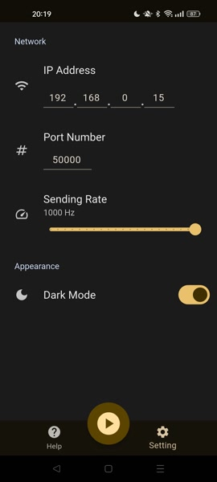
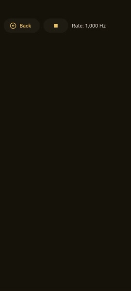

<h1>Touch Sender</h1>
    
A <b>multi-threaded</b> application that detects <b>single-touch</b> inputs and transmits the state via UDP at up to 1000 Hz.  
        Designed for <b>responsive performance</b> and <b>low latency communication</b>, it ensures seamless, high-speed data transfer for time-critical applications.

<table align="center">
    <tr>
        <td align="center">
            
        </td>
        <td align="center">
            
        </td>
    </tr>
    <tr>
        <td align="center">
            
Settings screen

        </td>
        <td align="center">
            
Touchpad screen

        </td>
    </tr>
</table>

## Features

- Sends touch status (single touch) via UDP.
- Transmits data at up to 1000Hz.
- Multithreaded design: touch detection and UDP transmission run on separate threads.

## Installation

### Android

| Platform        | Links                                                                                                                                                    |
| --------------- | -------------------------------------------------------------------------------------------------------------------------------------------------------- |
| GitHub Releases |  |
| Deploy Gate     |                                                                        |

### iOS

Currently not available.

## Example Usage

### Spin Rhythm XD

Here is a demonstration video showing how to play a game using the data sent by this application, using the [TouchSenderTablet](https://github.com/voltaney/TouchSenderTablet) as the receiver.

https://github.com/user-attachments/assets/2acf9f1d-42dd-42c2-a63c-a2d8ba15cc77

For more information about related projects, check the [Related Projects](#related-projects) section below.

## Limitations

- Implemented in Flutter, which may cause some overhead due to the gesture arena mechanism.
- Touch data is currently handled in [Flutter's logical pixels](https://api.flutter.dev/flutter/dart-ui/FlutterView/devicePixelRatio.html), not in physical screen coordinates.
- Currently, only single-touch is supported. Multi-touch support is not yet implemented.

## Related Projects

- [TouchSenderInterpreter](https://github.com/voltaney/TouchSenderInterpreter): A library for parsing data received from this application. Available on [NuGet](https://www.nuget.org/packages/Voltaney.TouchSenderInterpreter/).
- [TouchSenderTablet](https://github.com/voltaney/TouchSenderTablet): A Windows application that controls the PC mouse using data received from this application.
